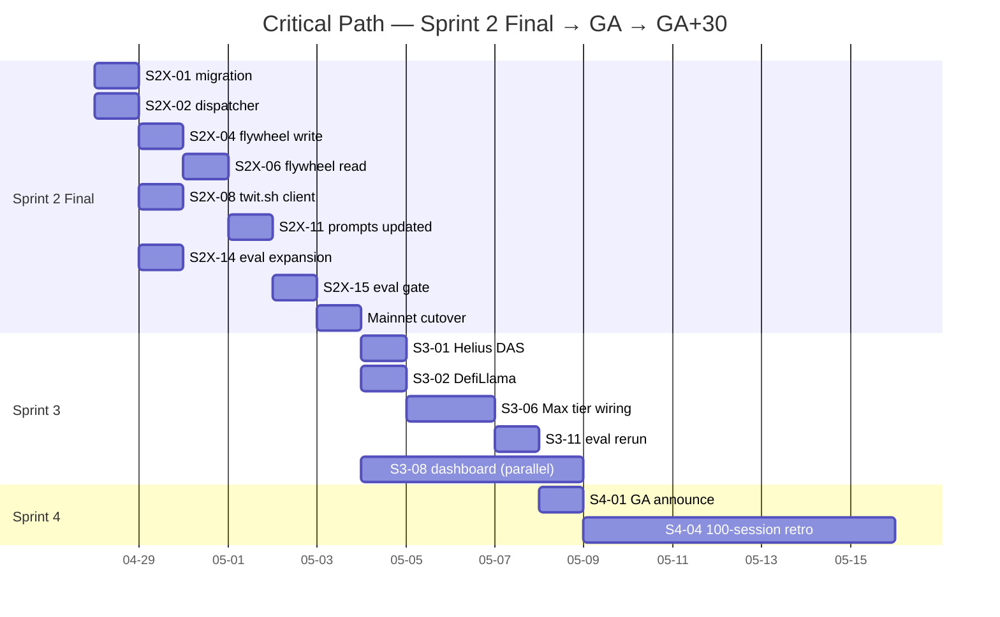

# Build Plan — V1 GA through GA+30 (Source of Truth)

**Date:** 2026-04-28
**Author:** staff-engineer
**Status:** Active. Supersedes `docs/roadmap-post-grant.md` (now retrospective).
**Scope:** Sprint 2 Final → Sprint 3 → Sprint 4 → Sprint 5+ parking lot. ~4 weeks to GA+post-launch.
**References (do not duplicate):** `docs/v1-build-plan-external-sources.md`, `docs/external-sources-survey.md`, `docs/roadmap-post-grant.md`.

---

## 0. Locked Decisions

1. frames.ag one-pager: send before Monday demo. Owner: business-manager.
2. Max tier: launches alongside Sprint 3 V2 source rollout.
3. Eval harness: expand to `crypto_suite` (15) + `saas_suite` (15) + retain `general_suite` (20) = 50 ideas.
4. Idea classifier: embedding nearest-neighbor (S effort, 50 seed ideas, threshold 0.62).
5. twit.sh: ship without SLA. Wallet capped $5, sentinel-disable on outage.
6. twit.sh wallet funded from Ernani's personal USDC; receipt routed through Gecko ops budget.

---

## 1. Sprint 2 Final — V1 Source Rollout + Flywheel + Classifier

**Window:** This week, 4–5 days. Theme: V1 source rollout + flywheel + classifier.
**Goal:** Every Pro session fires 6 V1 sources, writes flywheel, expanded eval harness shows `verdict_accuracy ≥ 0.85` on each of crypto / saas / general sub-suites individually.

### Tickets

| ID | Title | Owner | Effort | Blocked-by |
|---|---|---|---|---|
| S2X-01 | Migration `015_gecko_precedent` | data-engineer | S (3h) | — |
| S2X-02 | Source dispatcher module | software-engineer | M (6h) | — |
| S2X-03 (REPLACED) | Embedding-NN idea classifier | software-engineer | S (4h) | — |
| S2X-04 | Flywheel write-path hook | software-engineer | S (3h) | S2X-01, S2X-02 |
| S2X-05 | Flywheel privacy guardrail (CI) | data-engineer | S (3h) | S2X-04 |
| S2X-06 | Flywheel read-path retrieval | software-engineer | S (3h) | S2X-01, S2X-04 |
| S2X-07 | HN + Reddit source modules | software-engineer | XS (2h) | S2X-02 |
| S2X-08 | twit.sh client + catalog bake | web3-engineer | M (6h) | S2X-02 |
| S2X-09 | twit.sh wallet provisioning + alarm | web3-engineer | S (4h) | — |
| S2X-10 | MongoDB `twitsh_cache` | data-engineer | S (3h) | S2X-08 |
| S2X-11 | Pro prompts reference new blocks | software-engineer | S (3h) | S2X-04/06/08 |
| S2X-12 | MCP/CLI opt-in PATs surface | software-engineer | S (3h) | S2X-02 |
| S2X-13 (REPLACED) | Send frames.ag one-pager + capture response | business-manager | S (3h) | — |
| S2X-14 (NEW) | Eval harness expansion (crypto + saas sub-suites) | software-engineer | M (6h) | — |
| S2X-15 (NEW) | Eval rerun gate ≥ 0.85 per sub-suite | software-engineer | S (3h) | S2X-11, S2X-14 |

### S2X-03 spec (embedding-NN classifier)

- Seed set: 50 hand-labeled ideas across 6 categories: `crypto`, `defi`, `devtools`, `saas`, `regulated`, `hackathon-team`. Stored at `packages/gecko-core/src/gecko_core/classify/seeds.json`.
- Embedding: `text-embedding-3-small` (already wired). Seed embeddings precomputed and pickled to `seeds.npz`; loaded at module import.
- Classification: top-1 cosine on incoming idea. If max similarity < 0.62 → label `unknown`.
- **Multi-label:** support up to top-2 categories above 0.62 (so a "defi devtool" idea fires both Helius DAS gates and GitHub).
- Test: held-out 20-idea labeled set. Assert accuracy ≥ 0.80. File: `packages/gecko-core/tests/test_classifier_accuracy.py`.

### S2X-14 spec (eval harness expansion)

- `tests/eval/suites/crypto_suite.json` — 15 ideas, balanced 7 ship + 8 kill, each with `expected_verdict`, `expected_categories`, `must_cite_sources` (e.g. crypto ideas should cite at least one of: colosseum, x_signal, gecko_precedent).
- `tests/eval/suites/saas_suite.json` — same shape, 15 ideas.
- `tests/eval/suites/general_suite.json` — existing 20 ideas, renamed.
- Runner accepts `--suite crypto|saas|general|all`. Default `all`.
- Re-baseline on commit `8c3cdfe`: 30 fresh runs, 1 baseline JSON per suite at `tests/eval/baselines/{suite}_baseline.json`.

### S2X-15 spec (eval gate)

- CI matrix runs each suite separately. Per-suite verdict_accuracy must be ≥ 0.85.
- **Runs in mock-mode only** for the regression check (twit.sh stubbed, Tavily mocked) to avoid burning the $5 wallet cap during eval.
- Live mode runs are manual, single-shot, captured to `tests/eval/live_runs/<date>.json`.
- If any sub-suite < 0.85 → block GA, kick prompt rework iteration before merging Sprint 2 Final.

### Acceptance demo

```bash
bb research --pro --idea "credit card on Solana for retail merchants"   # crypto
bb research --pro --idea "AI-powered changelog generator for B2B SaaS"  # saas
uv run pytest tests/eval/ --suite all -v
gecko-mcp doctor
```

### Risks

- twit.sh wallet drains during eval → S2X-15 mock-only mitigates.
- Embedding classifier mis-routes → held-out test gate; `unknown` fallback fires safe baseline.
- Frames.ag responds with "let's talk" mid-sprint → defer integration to S3-05; do not pivot Sprint 2 Final.

---

## 2. Mainnet Cutover Window (interleaves Sprint 2 Final)

**Decision (ADR-0001):** Cut over to mainnet **after** V1 sources land and eval clears. File: `docs/decisions/0001-mainnet-after-v1-sources.md`.

Triggers immediately after S2X-15 passes. Cutover itself is ~1 day of work. Owner: web3-engineer.

---

## 3. Sprint 3 — V2 Sources + Max Tier Launch + V3 Dashboard

**Window:** ~2 weeks. Theme: V2 sources, Max tier, dashboard read-only.

| ID | Title | Owner | Effort | Blocked-by |
|---|---|---|---|---|
| S3-01 | Helius DAS source (crypto-shape sessions) | web3-engineer | M (6h) | S2X-02 |
| S3-02 | DefiLlama source (TVL + protocol category) | web3-engineer | S (4h) | S2X-02 |
| S3-03 | GitHub trending source (devtools/saas) | software-engineer | S (4h) | S2X-12 |
| S3-04 | Wellfound API source (B2B/SaaS hiring proxy) | software-engineer | M (6h) | S2X-02 |
| S3-05 | frames.ag user-context integration (conditional) | web3-engineer | M (6h) | S2X-13 response |
| S3-06 | Max tier wiring (3 routes, AG2 budget escalation, MCP surface) | software-engineer | M (8h) | S2X-15 |
| S3-07 | Max pricing decision doc + COGS review | business-manager | S (4h) | Sprint 2 telemetry |
| S3-08 | V3 dashboard scaffold (Next.js, gecko-mcpay-app) | frontend-engineer | L (12h) | API contract stable |
| S3-09 | V3 dashboard transcript viewer UX spec | product-designer | M (6h) | S3-08 scaffold |
| S3-10 | gecko-sample-devbrief regen with V1 sources | software-engineer | S (4h) | S2X-15 |
| S3-11 | Eval rerun post-V2 sources (≥0.85 each, ≥0.90 crypto) | software-engineer | S (3h) | S3-01, S3-02 |

### S3-05 conditional logic

- If frames.ag responds + ships `/v1/user/context` by Sprint 3 mid → wire enriched persona prompts (Max-M+ only).
- Else → stub with no-op enrichment, log telemetry, slip real integration to Sprint 4 backlog (acceptable). No code-rewrite penalty: enrichment hook is a single function call gated on env var.

### S3-06 Max tier wiring

- Routes registered in x402 RouteConfig: `/research?tier=max-s` ($2), `?tier=max-m` ($5), `?tier=max-l` ($15).
- AG2 budget per tier: max-s = pro × 1.5, max-m = pro × 4, max-l = pro × 12 (LLM token budgets).
- Source-allocation per tier:
  - max-s: all V1 sources + Helius DAS + DefiLlama (V2 always-on).
  - max-m: max-s + frames.ag persona + GitHub trending + Wellfound (if classified).
  - max-l: max-m + 2x Tavily depth + judge-thread distillation expanded to top-15 (vs. top-5).
- MCP surface: `gecko_research(..., tier="max-m")`.

### Acceptance demo

```bash
bb research --tier max-m --idea "real-world-asset lending protocol on Solana"
gecko-mcp economics <session_id>   # shows Max-M margin > 70%
```

### Risks

- frames.ag delay → S3-05 slips, acceptable.
- Helius free-tier 10 RPS during burst eval → cache aggressively in MongoDB (`helius_cache`, TTL 1h for DAS, 5m for fee data).
- Max-L margin compresses below 70% → S3-07 doc raises price to $19 or trims max-l source list. Decision before merge.

---

## 4. Sprint 4 — Paying-User Signal + Polish + Attribution v0

**Window:** ~1.5 weeks. Theme: GA polish, real-margin retro, creator attribution read-only.

| ID | Title | Owner | Effort | Blocked-by |
|---|---|---|---|---|
| S4-01 | GA launch announcement + landing copy refresh | business-manager + product-designer | M (6h) | S3 demo passes |
| S4-02 | Creator attribution v0 (read-only graph) | data-engineer | M (8h) | S2X-04 |
| S4-03 | Resend transactional welcome email on waitlist insert | software-engineer | S (3h) | — |
| S4-04 | First-100-mainnet-sessions retro + margin analysis | business-manager | M (6h) | 100 sessions logged |
| S4-05 | Privy budget cryptographic enforcement v2.5 (sign tx ≤ budget) | web3-engineer | M (10h) | mainnet live |
| S4-06 | Eval harness nightly cron in CI (mock-mode) | software-engineer | S (3h) | S2X-14 |
| S4-07 | Sprint 1 v1.1 leftovers (V11-04 verify, V11-09 verify, idea_override patch) | software-engineer | S (4h) | — |

### Acceptance demo

geckovision.tech landing shows "100+ Pro sessions, $X gross, X% margin." `GET /attribution?url=https://news.ycombinator.com/item?id=123` returns `{ session_count: 7, nominal_earned_usd: 0.42, ... }`.

---

## 5. Sprint 5+ Parking Lot

Tracked, not scheduled:
- On-chain creator attribution settlement.
- Premium tier ($1.50) with regulatory/on-chain layers.
- Self-hosted facilitator.

**Explicit out-of-scope:** mobile/iOS/Android, TS/Go SDKs, multi-tenant org accounts, DAO governance.

---

## 6. Cross-Cutting Concerns

### A. Privacy posture across all sources

| Source | Persists where | Retention | Deletion API |
|---|---|---|---|
| Tavily results | `sessions.research_result` JSONB | 90d | `DELETE /v1/me/sessions/<id>` cascades |
| Flywheel (`gecko_precedent`) | Supabase, RLS | until user delete | `DELETE /v1/me/precedent/<id>` |
| HN / Reddit | session JSONB | 90d | session delete |
| Colosseum | session JSONB | 90d | session delete |
| GitHub | session JSONB | 90d | session delete |
| twit.sh | MongoDB `twitsh_cache` (12h TTL); session JSONB (90d) | TTL or 90d | TTL auto |
| Helius DAS | MongoDB `helius_cache` (1h TTL); session JSONB | TTL or 90d | TTL auto |
| frames.ag persona | session JSONB only; never written to flywheel | 90d | session delete |

**Rule:** flywheel summary is LLM-generated (≤30% verbatim overlap, CI-enforced via S2X-05). User-identifying fields never reach flywheel.

### B. Cost model evolution

| Phase | SKU | Price | Worst-case COGS | Margin |
|---|---|---|---|---|
| Today | Pro | $0.75 | $0.10 | 87% |
| Sprint 2 Final | Pro+V1 | $0.75 | $0.156 | 79% (cold), 84% (warm) |
| Sprint 3 | Pro / Max-S / Max-M / Max-L | $0.75 / $2 / $5 / $15 | $0.18 / $0.45 / $1.20 / $4.20 | 76% / 78% / 76% / 72% |
| Sprint 4 | same, post-retro | possibly $0.75 / $1.99 / $4.99 / $14.99 | actual measured | TBD |

S3-07 final-prices the ladder against measured Sprint 2 Final COGS telemetry.

### C. Eval harness as regression gate

- Every prompt change → re-run all 3 suites; no merge if any drops > 0.03 from baseline.
- Every source addition → re-run; new baseline written.
- S4-06 cron alerts on regression in `main` nightly.

### D. frames.ag dependency map

| Capability | Without frames.ag | With frames.ag `/v1/user/context` |
|---|---|---|
| V1 (Sprint 2 Final) | full — no dependency | n/a |
| Max-M+ persona personalization | stub no-op | enriched prompts |
| User-history-grounded verdicts | flywheel-only (own sessions) | flywheel + frames profile |
| Fallback if frames slips indefinitely | Helius direct + twit.sh covers crypto persona; no SaaS persona analog | — |

### E. MongoDB scope-creep guard

**Rule:** writes to MongoDB are allowed iff:
- Data is opaque, write-once-read-many cache (no JOINs to `sessions`/`projects`).
- TTL is defined.
- Loss of the cache is non-fatal.

Anything that needs a JOIN to sessions/projects/users/wallets → Supabase. No exceptions. Document in `CLAUDE.md` recurring-patterns section.

Current MongoDB collections allowed: `twitsh_cache`, `helius_cache`. Future additions require staff-engineer review.

---

## 7. Agent Assignment Matrix

### staff-engineer
| Sprint | Tickets |
|---|---|
| S2 Final | ADR-0001 (mainnet-after-V1), S2X-13 (co-owner) |
| S3 | architecture review on S3-06 Max wiring, S3-08 dashboard contract |
| S4 | review on S4-02 attribution data model |

### software-engineer
| Sprint | Tickets |
|---|---|
| S2 Final | S2X-02, S2X-03, S2X-04, S2X-06, S2X-07, S2X-11, S2X-12, S2X-14, S2X-15 |
| S3 | S3-03, S3-04, S3-06, S3-10, S3-11 |
| S4 | S4-03, S4-06, S4-07 |

### data-engineer
| Sprint | Tickets |
|---|---|
| S2 Final | S2X-01, S2X-05, S2X-10 |
| S3 | (review on cache schemas) |
| S4 | S4-02 |

### web3-engineer
| Sprint | Tickets |
|---|---|
| S2 Final | S2X-08, S2X-09, mainnet-cutover execution |
| S3 | S3-01, S3-02, S3-05 |
| S4 | S4-05 |

### frontend-engineer (cross-repo stub → real impl in `gecko-mcpay-app`)
| Sprint | Tickets |
|---|---|
| S2 Final | API contract review |
| S3 | S3-08 (full impl in sister repo) |
| S4 | landing copy hooks for S4-01 |

### business-manager
| Sprint | Tickets |
|---|---|
| S2 Final | S2X-13 (frames.ag one-pager send + capture response) |
| S3 | S3-07 (Max pricing decision doc) |
| S4 | S4-01, S4-04 |

### product-designer
| Sprint | Tickets |
|---|---|
| S2 Final | terminal output spec for new V1 source blocks (debate transcript reveal) |
| S3 | S3-09 (transcript viewer UX) |
| S4 | S4-01 (landing copy refresh visuals) |

---

## 8. Critical Path

**Single most-critical ticket:** `S2X-15` (eval gate). It blocks mainnet cutover, which blocks Sprint 3 Max tier launch, which blocks S4-01 GA announce. Slip 1 day on S2X-15 → slip GA 1 day. Owner: software-engineer.



---

## 9. Open Questions for User (≤ 5)

1. **Mainnet cutover window:** ADR-0001 recommends cutover Tue/Wed of Sprint 3 week 1 (after S2X-15 passes). Confirm acceptable, or prefer same-day-as-S2X-15-pass to compress timeline?
2. **Wellfound source (S3-04):** their free tier rate-limits aggressively. Confirm we can drop it to Sprint 4 if Sprint 3 hours run tight?
3. **Max-L pricing if margin <70%:** S3-07 may surface that $15 yields 68%. Authorize bump to $19, or hold at $15 and trim source allocation?
4. **gecko-sample-devbrief regen (S3-10):** after regen, may we ship a public side-by-side ("V0 PRD vs V1 PRD") as marketing?
5. **frames.ag silent past Sprint 3 start:** if no response 5 days after one-pager send, do we cold-call Solana Foundation contacts to expedite, or accept stub-and-defer?

---

## 10. Communication Cadence

- **Per-ticket:** no update needed. Tickets self-report via PR descriptions.
- **End of each working day during Sprint 2 Final:** 3-bullet status (what landed / what's blocked / next-up).
- **End of each sprint:** written retro at `docs/retros/<sprint>.md`.
- **Eval-gate failure:** immediate ping; do not wait for daily.
- **frames.ag response (any direction):** immediate ping; gates S3-05.
- **Mainnet cutover:** real-time during the window.

---

## Totals

- **Tickets:** 15 (S2X) + 11 (S3) + 7 (S4) + ADR-0001 = **34**.
- **Effort:** ~52h S2 Final + ~67h S3 + ~40h S4 = **~159h ≈ 20 person-days** across 7 agents over 4 weeks.

---

## Surfaces that emerged while writing the plan

1. **Eval harness needs mock-mode for regression gate.** Live runs would burn the $5 twit.sh wallet on every CI invocation. S2X-15 stubs twit.sh + Tavily; live runs become manual, single-shot, captured to `tests/eval/live_runs/<date>.json`.
2. **Classifier needs multi-label (top-2 above 0.62).** Real ideas straddle categories ("defi devtool"); single-label routing under-fires sources. ~30 min addition, no effort change.
3. **MongoDB scope-creep guard belongs in CLAUDE.md.** Document the JOIN rule explicitly before S3-01 lands `helius_cache`, otherwise the second cache collection is the moment scope creep starts.
